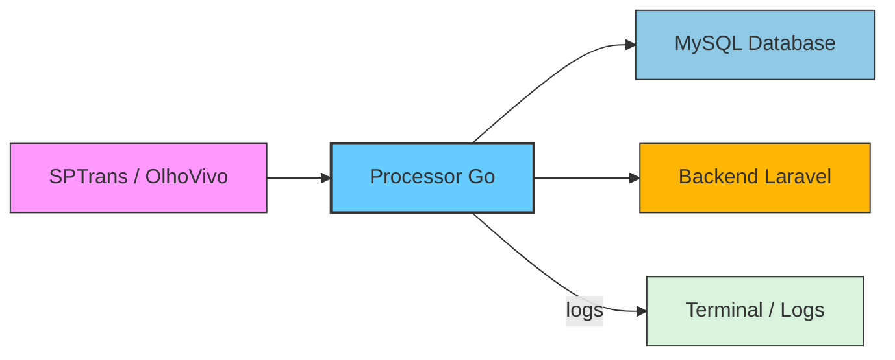
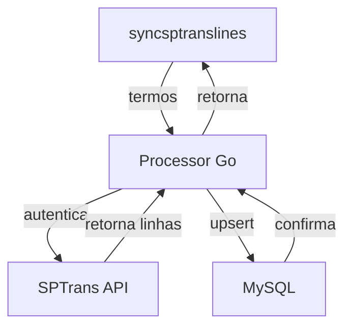
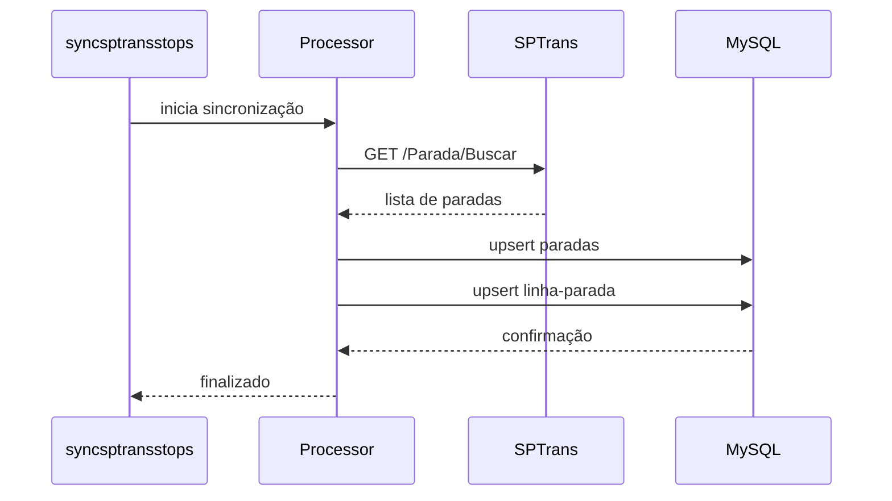
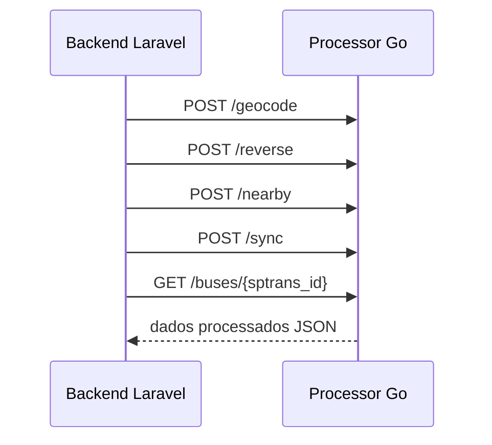
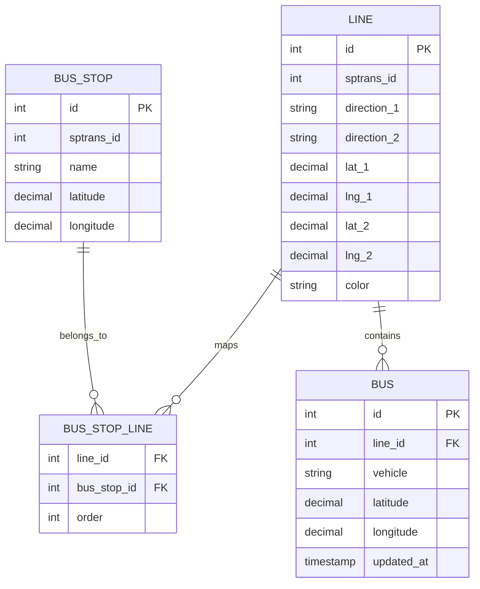

# 🟦 Processor - Documentação Limpa

> Documentação do processor Go do Mobility Project.

---

## 📋 Índice

1. [Visão Geral](#-visão-geral)
2. [Stack Tecnológico](#-stack-tecnológico)
3. [Arquitetura](#-arquitetura)
4. [Estrutura de Diretórios](#-estrutura-de-diretórios)
5. [Setup e Instalação](#-setup-e-instalação)
6. [Variáveis de Ambiente](#-variáveis-de-ambiente)
7. [Comandos Principais](#-comandos-principais)
8. [API Exposta](#-api-exposta)
9. [Fluxo de Sincronização](#-fluxo-de-sincronização)
10. [Consumo pelo Backend](#-consumo-pelo-backend)
11. [Modelo de Dados](#-modelo-de-dados)
12. [Testes](#-testes)
13. [Troubleshooting](#-troubleshooting)

---

## 🎯 Visão Geral

O processor Go é o microserviço responsável por:

- Sincronizar dados da SPTrans
- Processar geocoding e reverse geocoding
- Filtrar linhas e paradas por proximidade
- Oferecer dados para o backend Laravel
- Expor uma API interna leve

Ele é construído como um serviço Go com endpoints HTTP e uma linha de comando para tarefas de sincronização.

---

## 🧠 Stack Tecnológico

- Go 1.26
- `github.com/go-sql-driver/mysql`
- `github.com/joho/godotenv`
- MySQL 8+
- HTTP padrão do Go

---

## 🏗️ Arquitetura



---

## 📁 Estrutura de Diretórios

```
mobility_processor/
├── cmd/
│   ├── server/
│   ├── syncsptranslines/
│   ├── syncsptransstops/
│   ├── importgtfsstops/
│   ├── fetchstops/
│   └── geocodelines/
├── internal/
│   ├── api/
│   ├── geocoding/
│   ├── haversine/
│   ├── lines/
│   ├── sptrans/
│   └── stops/
├── data/
├── go.mod
└── go.sum
```

---

## 🔧 Setup e Instalação

### Pré-requisitos

- Go 1.26+
- MySQL 8+
- Git

### Instalação

```bash
cd mobility_processor
go mod download
cp .env.example .env
```

### Compilar

```bash
cd mobility_processor
mkdir -p bin
go build -o bin/server ./cmd/server
go build -o bin/syncsptranslines ./cmd/syncsptranslines
go build -o bin/syncsptransstops ./cmd/syncsptransstops
go build -o bin/importgtfsstops ./cmd/importgtfsstops
go build -o bin/fetchstops ./cmd/fetchstops
go build -o bin/geocodelines ./cmd/geocodelines
```

### Executar serviço HTTP

```bash
cd mobility_processor
export PORT=8080
./bin/server
```

> O servidor lê `PORT` e usa `8080` por padrão se não estiver definido.

---

## ⚙️ Variáveis de Ambiente

```env
DB_HOST=127.0.0.1
DB_PORT=3306
DB_NAME=mobility_project
DB_USER=mobility_user
DB_PASSWORD=mobility_2026

SPTRANS_API_TOKEN=your_sptrans_token_here
SPTRANS_API_BASE_URL=https://api.olhovivo.sptrans.com.br/v2.1

PORT=8080
```

---

## 🧰 Comandos Principais

### `cmd/server`

Inicia o servidor HTTP que expõe a API do processor.

### `cmd/syncsptranslines`

Sincroniza linhas SPTrans por termos em paralelo.

### `cmd/syncsptransstops`

Sincroniza paradas SPTrans e relaciona paradas a linhas.

### `cmd/importgtfsstops`

Importa dados de paradas a partir de arquivos GTFS.

### `cmd/fetchstops`

Busca paradas de forma customizada para importação ou validação.

### `cmd/geocodelines`

Geocodifica linhas e ajusta coordenadas faltantes.

---

## 🌐 API Exposta

O `cmd/server` registra as rotas no package `internal/api`.

### Rotas conhecidas

- `GET /buses/{sptrans_id}` — posições de ônibus por ID SPTrans
- `POST /geocode` — converte endereço em coordenadas
- `POST /reverse` — converte coordenadas em endereço
- `POST /nearby` — filtra linhas próximas com base em endereço e conjunto de linhas
- `POST /sync` — sincroniza dados SPTrans por termos

### Exemplo de uso

#### `POST /geocode`

```json
{
  "address": "Avenida Paulista, 1000"
}
```

#### `POST /reverse`

```json
{
  "lat": -23.561414,
  "lng": -46.655881
}
```

#### `POST /nearby`

```json
{
  "address": "Av. Paulista, 1000",
  "radius_km": 1.0,
  "lines": [
    {"id": 1, "sptrans_id": 33624, "direction_1": "..."}
  ]
}
```

#### `POST /sync`

```json
{
  "terms": ["0", "1", "2"]
}
```

---

## 🔁 Fluxo de Sincronização

### Sincronização de linhas SPTrans



### Sincronização de paradas SPTrans



---

## 🔄 Consumo pelo Backend

O backend Laravel consome o processor Go por meio do `ProcessorService`.



---

## 🧩 Modelo de Dados



---

## 🧪 Testes

### Testes do Go

```bash
cd mobility_processor
go test ./...
```

---

## ⚠️ Troubleshooting

### O servidor não sobe

- Verifique `PORT`
- Confirme `SPTRANS_API_TOKEN`
- Execute `go build` novamente

### Erro de conexão com MySQL

- Valide `DB_HOST`, `DB_PORT`, `DB_USER`, `DB_PASSWORD`
- Teste `mysql -h 127.0.0.1 -u mobility_user -p`

### Endpoint `/geocode` retorna erro

- Verifique se o serviço de geocoding foi inicializado corretamente
- Confira o body JSON enviado

---

## 💡 Observações

- Use `PROCESSOR.md` para entender o microserviço Go e seu contrato com o backend.
- O backend deve tratar falhas de rede e retornar dados seguros ao cliente.
- Mantenha este documento sincronizado com `mobility_processor/internal/api/handler.go` e `mobility_backend/app/Services/ProcessorService.php`.
"""
