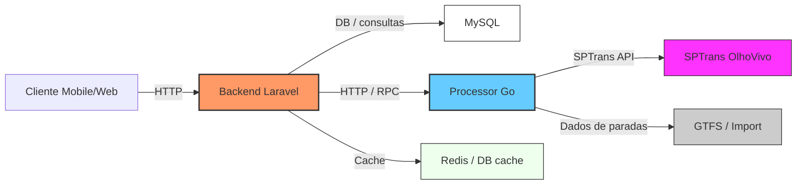
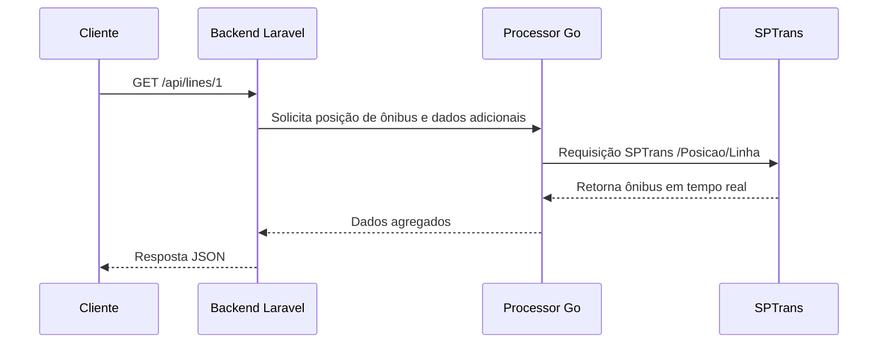
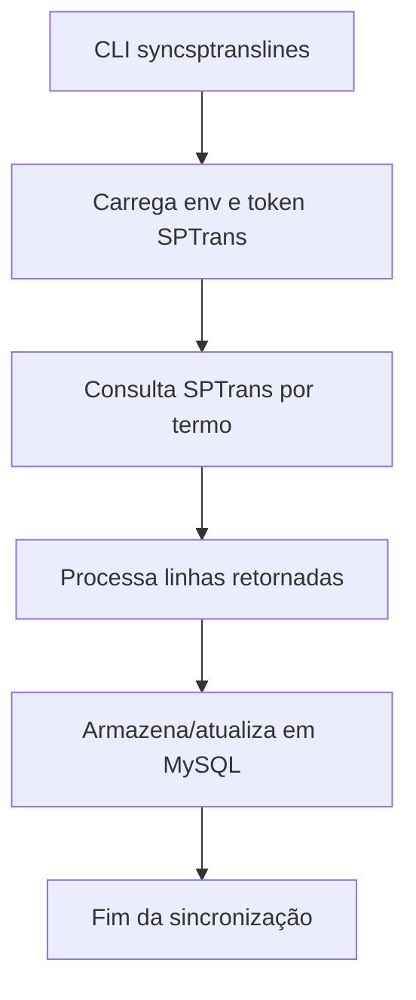
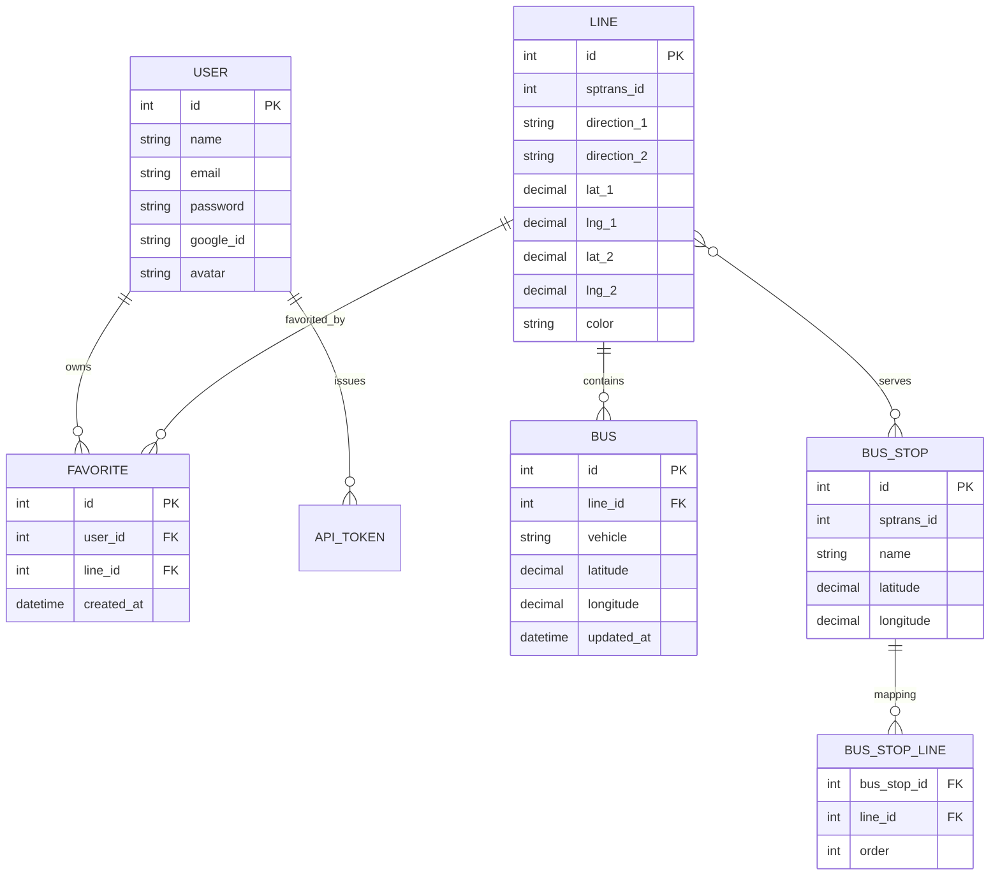

# Mobility Project

> Plataforma de mobilidade urbana para São Paulo, composta por um backend Laravel e um processor Go que trabalham em conjunto para entregar dados de transporte público em tempo real.

---

## 📌 Visão Geral

O projeto foi dividido em duas responsabilidades principais:

- **Backend** (`mobility_backend/`): API RESTful em Laravel 11 responsável por autenticação de usuários, gerenciamento de favoritos, consulta de linhas, paradas e integração com serviços externos.
- **Processor** (`mobility_processor/`): Serviço em Go responsável por sincronização de dados com a API SPTrans, processamento geoespacial, importação de paradas e exposição de APIs internas.

O objetivo é manter o backend leve e focado em negócio, enquanto o processor realiza tarefas de sincronização, cálculo e enriquecimento de dados.

---

## 🧭 Arquitetura Geral



### Como os dois componentes se conectam

1. O **backend** responde às solicitações do cliente e serve endpoints de API.
2. Quando necessário, o backend consulta o **processor** para dados processados ou geocodificação.
3. O **processor** sincroniza automaticamente as linhas e paradas com o SPTrans e mantém uma base atualizada para consumo.
4. O backend entrega os dados ao cliente em formato JSON com suporte a filtros, favoritos e geolocalização.

---

## 🗂️ Estrutura do Repositório

```
mobility_project/
├── BACKEND.md
├── PROCESSOR.md
├── README.md
├── mobility_backend/
│   ├── app/
│   ├── config/
│   ├── database/
│   ├── public/
│   ├── resources/
│   ├── routes/
│   └── tests/
└── mobility_processor/
    ├── cmd/
    ├── internal/
    ├── data/
    ├── go.mod
    └── go.sum
```

---

## 📘 O que cada parte faz

### Backend (`mobility_backend`)

- Gestão de usuários e tokens com Laravel Sanctum
- Autenticação via Google OAuth e credenciais tradicionais
- Endpoints para linhas, paradas, ônibus e favoritos
- Validação via Form Requests
- Uso de serviços, repositórios e DTOs para separar lógica de negócio

### Processor (`mobility_processor`)

- Sincronização de linhas e paradas da API SPTrans
- Importação de dados GTFS e normalização de paradas
- Geocodificação e reverse geocoding
- Cálculos de distância e proximidade com Haversine
- API interna para consulta de dados processados

---

## 🧩 Fluxos principais

### Fluxo de consulta de linha com ônibus em tempo real



### Fluxo de sincronização de linhas



---

## 🧠 Diagrama de Dados (ERD)



> O ERD acima mostra os relacionamentos mais importantes do backend. O processor mantém tabelas próprias para sincronização e geocodificação, mas a base central do domínio de linhas e paradas é compartilhada.

---

## 🧪 Setup completo

### Backend

```bash
cd mobility_backend
composer install
cp .env.example .env
php artisan key:generate
php artisan migrate
npm install
npm run build
```

### Processor

```bash
cd mobility_processor
go mod download
```

### Execução em desenvolvimento

```bash
# Backend
cd mobility_backend
php artisan serve

# Processor
cd mobility_processor
go run ./cmd/server/main.go
```

---

## 🔧 Variáveis de ambiente principais

As variáveis podem ser definidas em `mobility_backend/.env` e `mobility_processor/.env`.

```env
SPTRANS_API_TOKEN=your_sptrans_token
GOOGLE_CLIENT_ID=...
GOOGLE_CLIENT_SECRET=...
GOOGLE_REDIRECT_URI=http://localhost:8000/api/auth/google/callback
DB_HOST=127.0.0.1
DB_PORT=3306
DB_DATABASE=mobility_project
DB_USERNAME=mobility_user
DB_PASSWORD=mobility_2026
SERVER_PORT=3000
```

---

## 🔎 Documentação detalhada

- `BACKEND.md` — toda a documentação do backend Laravel, incluindo endpoints, models e fluxo de autenticação.
- `PROCESSOR.md` — documentação do processor Go, incluindo comandos, fluxos de dados e configurações.

---

## 🚀 Principais Endpoints

- `POST /api/auth/login`
- `POST /api/auth/register`
- `GET /api/lines`
- `GET /api/lines/search`
- `GET /api/lines/{id}`
- `GET /api/stops/nearest`
- `POST /api/geocode`
- `GET /api/lines/{lineId}/buses`
- `GET /api/favorites`

> Para a lista completa de endpoints, consulte `BACKEND.md`.

---

## 🛠️ Como entender a separação

### Backend é responsável por

- Autenticação e autorização
- Retorno de respostas JSON para o cliente
- Validação de requisições
- Regras de negócio de favoritos e consultas

### Processor é responsável por

- Sincronizar e atualizar dados da SPTrans
- Calcular distâncias e proximidade
- Geocodificar endereços
- Expor dados processados para o backend consumir

---

## 👥 Contribuição

1. Crie uma branch com `git checkout -b feature/descritivo`
2. Faça as alterações necessárias
3. Abra um Pull Request com descrição clara

---

## 📚 Referências

- `BACKEND.md`
- `PROCESSOR.md`
- `mobility_backend/`
- `mobility_processor/`
